# KUBERNETES

It is an open source container orchestration tool, it was developed by google. It helps in managing containerized applications which are deployed in different environments.

## Problems & Tasks of an container orchestration tool

The rise of micro services increased usage of container technologies because the containers actually offer the perfect host for small independent applications like microservices. The rise of containers and the micro service technology actually resulted in applications that now consist of hundreds or sometimes maybe even thousands of containers, now managing those loads of containers across multiple environments using scripts and self made tools can be really complex. Such a specific scenario actually caused the need for having container orchestration technologies.

## Features orchestration tool offer

  - High availability or no down time.   
  - Scalability or high performance.   
  - Disaster recovery – backup and restore.  

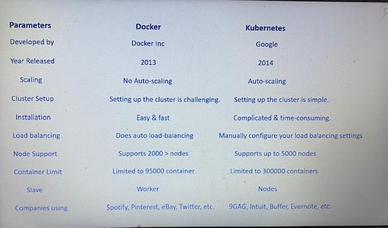

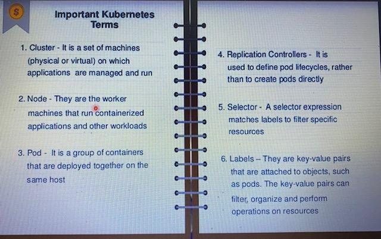

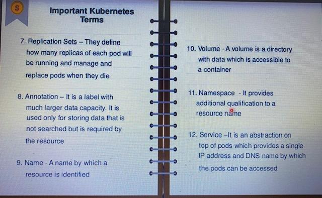

## Container + orchestration

Containers are completely isolated environments, as in they can have their own processes or services, their own networking interfaces, their own mounts just like VM’s. Except they all share the same OS kernel. Some of the different types of containers are LXC, LXD, LXCFS, docker utilizes LXC containers. Unlike Hypervisors docker is not meant to virtualize and run different operating systems and kernels on the same hardware. The main purpose of docker is to containerize applications and to ship
them and run them. Containers are running instances of images that are isolated and have their own environments and set of processes.

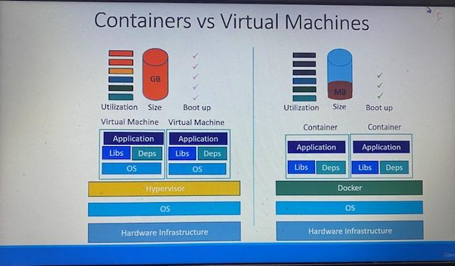

For suppose, let’s assume our application is packaged into a docker container, when it is running in production, What if your application
relies on other containers such as databases or messaging services or
other backend services. What if the number of users increases and you
need to scale your application? How do you scale down when the load
decreases? To enable these functionalities, you need an underlying
platform with a set of resources and capabilities. The platform needs to
orchestrate the connectivity between the containers and automatically
scale up or down based on the load. **This whole process of
automatically deploying and managing containers is known as Container
Orchestration**. kubernetes is just a container orchestration
technology. There are multiple such technologies available today, docker
has its own tool called docker swarm.

**Kubernetes is one such container orchestration technology used to
orchestrate the deployment and management of hundreds and thousands of
containers in a clustered environment**.

## K8's Architecture

Setting up of kubernetes cluster, let us start with nodes, A node is a
machine, physical or virtual on which kubernetes is installed. A node is a worker machine
and that is where containers will be launched by kubernetes. It was also known as
minions in the past. If the node on which the application is running fails, obviously
the application goes down. So we need to have more than one node. A cluster is a set of
nodes grouped together. The master is another node with kubernetes installed and is
responsible for taking care of the nodes.

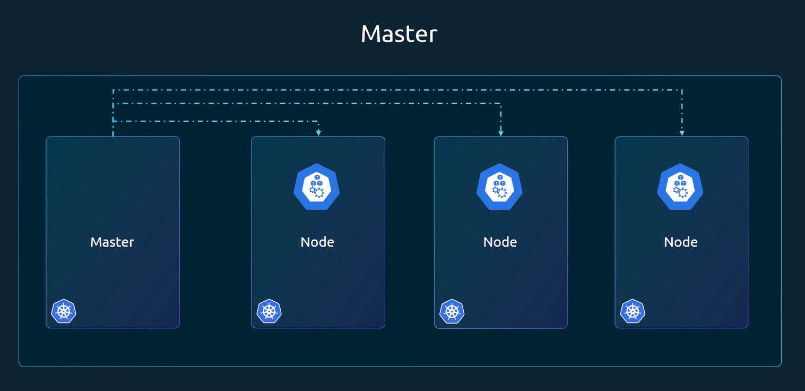

When we’re installing kubernetes on a system, we’re actually installing
the following components: an API, etcd service, kubelet, container
runtime, controller, scheduler. 

**API server** – It acts as the front end for kubernetes , the users,
management devices, CLI’s all talk to the API server to interact with
the kubernetes cluster.  
**etcd –** it is a distributed reliable key value store used by
kubernetes to store all data used to manage the cluster. Example: when
we have multiple masters and nodes in a cluster, etcd stores all that
information. Etcd is responsible for implementing locks within the
cluster to ensure that there are no conflicts between the masters.  
**Scheduler –** It is responsible for distributing work or containers
across multiple nodes, it looks for newly created containers and assigns
them to nodes.  
**Controllers -** The controllers are the brain behind orchestration,
they’re responsible for noticing and responding when nodes, containers
or end points go down. The controllers make decisions to bring up new
containers.  
**Container runtime -** The container runtime is the underlying software
that is used to run containers. In our case it happens to be ContainerD,
which we are using as a container runtime engine.  
**Kubelet –** The kubelet agent is installed on each node, the agent is
responsible for making sure that the containers are running on the nodes
as expected.

## Master vs Worker Nodes

So far, we saw two types of servers: master and worker and a set of
components that make up K8’s. But how are these components distributed
across different types of servers? The worker node or minion, as it is
known, is where the containers are hosted. For example, containerD. For
example, ContainerD containers. And to run ContainerD on a system, we
need a container runtime installed. And that’s where the container
runtime falls, in this case, it happens to be ContainerD. This doesn’t
have to be ContainerD, there are other container runtime alternatives
available such as **rkt** or **CRI-O**

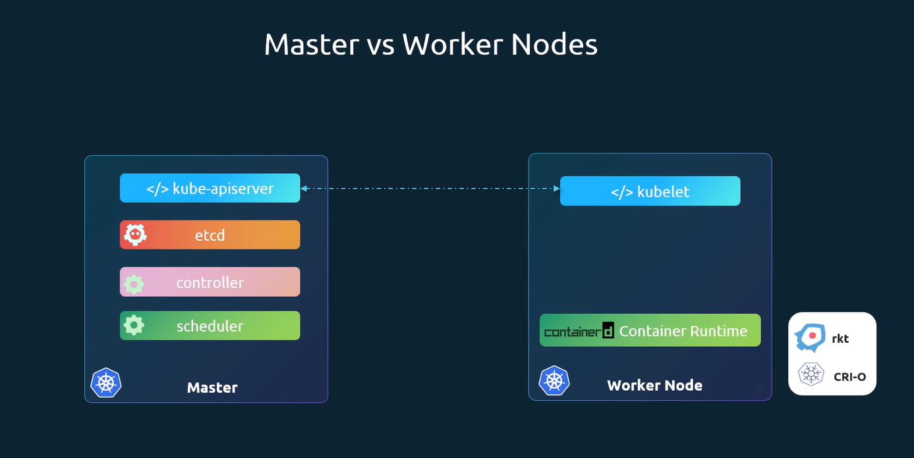

The master server has the kube API server and that is what makes it a
master, similarly, the worker nodes have the kubelet agent that is
responsible for interacting with a master to provide health information
of the worker node and carry out actions requested by the master on the
worker nodes. All the information gathered is stored in a key value
store on the master, which is etcd. The master also has the controller
and scheduler.

NOTE: 3 processes must be installed on every node that are used to
schedule and manage. Kubelet, kube proxy and container runtime.  
Kubelet interacts with both – the container and node, it is the process
that starts the pod with a container inside.  
Kubeproxy forwards the request.  
The other container runtime engines are RKT and CRI-O

## Kubectl

Kube command line tool or kubectl or kube control, the kubectl tool is
used to deploy and manage applications on a kubernetes cluster. To get
cluster information, to get status of other nodes in the cluster and to
manage many other things.

## Kubernetes Components

Pod, service, ingress   
Volumes   
Secrets, ConfigMap    
StatefulSet, Deployment  

**NODE & POD** - [<span
> class="underline">https://kubernetes.io/docs/concepts/workloads/pods/pod-overview/</span>](https://kubernetes.io/docs/concepts/workloads/pods/pod-overview/)

To deploy the application in the form of containers on a set ofmachines that are
configured as worker nodes in a cluster. However kubernetes does not deploy containers
directly on the worker nodes. The containers are encapsulated into a kubernetes object
known as pods. A pod is a single instance of an application. A pod is the smallest object
that you can create in kubernetes.

**Also, a pod is defined as a layer of abstraction on top of
containers and deployment is another abstraction on top of pods.**

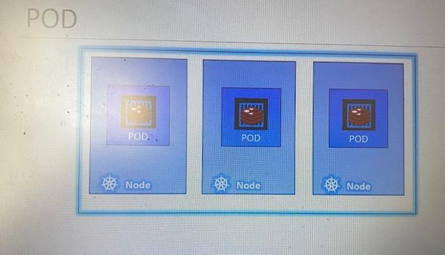

Additional containers cannot be added to an existing pod to scale the
application. Pods usually have a one to one relationship with the containers. Each pod
gets its own internal IP address that can communicate with other pods
in a server. Pod components in kubernetes also generate ports which
are ephemeral, which means that they can die very easily. If a pod
crashes, then a new pod gets created and a new internal IP address is
allocated to the pod, it is not so efficient, so in order to overcome this, we use a component called service.

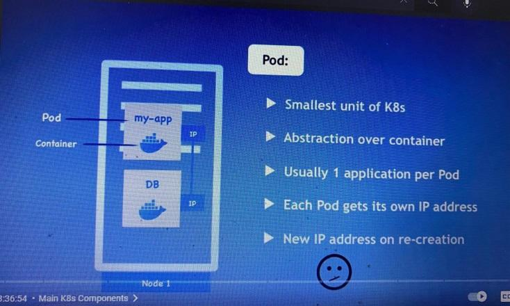

## Ingress & Service

Using this, a permanent IP will be allocated to the pod, and the
lifecycle of the pod and service is NOT connected. Even if the pod
crashes, the IP would remain the same. For the application to be
accessible to the browser, we can use another component called
ingress, it routes traffic to the kubernetes cluster.

## Service has got 2 functionalities:

  - Permanent IP  
  - Act as an load balancer 🡪 it actually catches the request and forward it to whichever pod is least busy.  
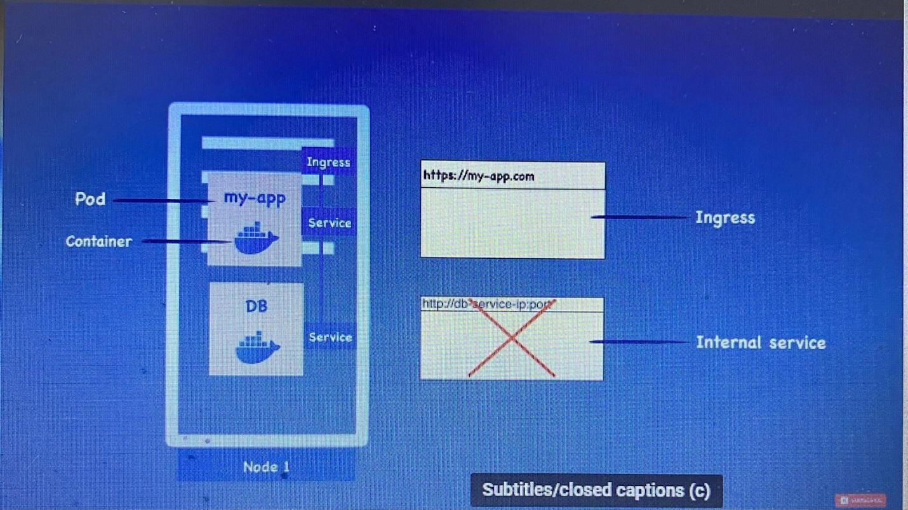

## ConfigMap & Secret

Here my-app uses the endpoint **mongo-db-service** to interact with
the database, usually we configure this end point in the properties
file of the application, for suppose if the end point of the service
or service name is changed to **mongo –db,** then we would have to
adjust that endpoint in the application, so we have to rebuild the
application, push it and pull it into the pod doing the entire process
again, it’s a tedious task.

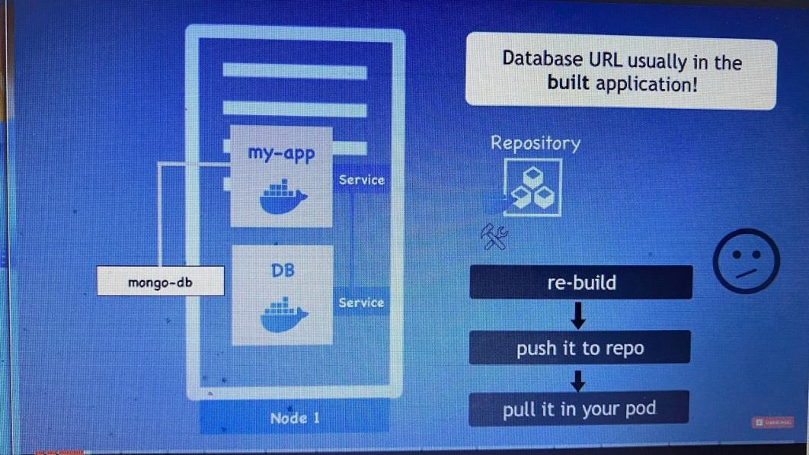

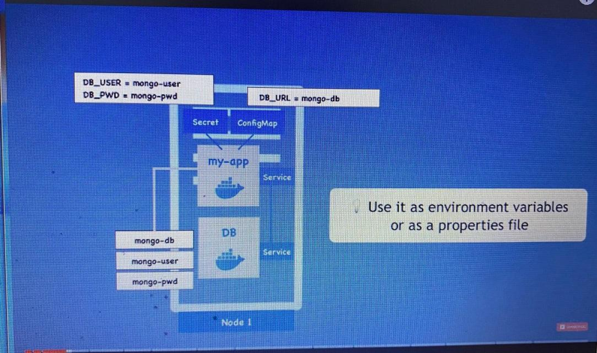

To avoid this, kubernetes has a component called config map, it’s
basically the external configuration to the application, usually
contains configuration data like urls of a database or some other
services that you use and in kubernetes you just connect it to the pod
so that the pod actually gets the data the configmap contains, if the
name of the service is changed, the endpoint gets adjusted based on
the config map.

The part of the external configuration can also be database username
and password , which may also change in the application deployment
 process, so putting these credentials in the external configuration
file is insecure, for this, kubernetes has another component called
**secret,** it stores data in **base64 encoded format.**

We can use the data in configMap or secret using the environment
variables or as a properties file.

## Volumes

This component is used to store data and log of the kubernetes pods,
without this, when the pods are turned off or gets crashed all of a
sudden, all the data will be lost, to avoid this we use volumes.

Think of a storage as an external hard drive plugged into the
kubernetes cluster, because the kubernetes cluster explicitly doesn’t
manage any data persistence, so it is the responsibility of the user
or the administrator to back up the data.

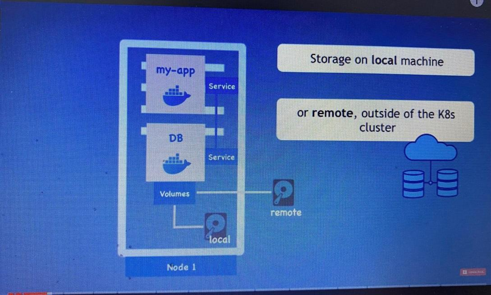

## Deployment

So in order to make the application available all time, we use replica
sets. Inorder to create the replica of the pod, there is no need to
create a 2<sup>nd</sup> pod, but instead we would define a blueprint
for the particular pod and specify how many replicas of that pod we
need to run, that component or that blueprint is called deployment, in
real we won’t create pods, instead we create deployments, because
there we can specify how many replicas we need.

The application can be replicated using deployment, but **DATABASE**
can’t be replicated using deployment, because DB has a state which is
its data, meaning that if we have clones or replicas of the DB they
would all need to access the same shared data storage and there we
would need some of mechanism that manages which pods are currently
writing to that storage or which pods are reading from the storage in
order to avoid data inconsistencies and that mechanism in addition to
replicating feature is offered by another kubernetes component called
**statefulset**.

In contrast, a stateful application saves data about each client
session and uses that data the next time the client makes a request.
When an application is stateless, the server does not store any state
about the client session. Instead, the session data is stored on the
client and passed to the server as needed.

Note: Deployment for stateless Apps and statefulset for stateful apps
or databases. It is a bit difficult to deploy stateful inside a single
node, so it is a common practice to host DB outside of K8s cluster.

## PODS

Kubernetes does not deploy containers directly on the node machines,
instead the containers are encapsulated into a kubernetes object known
as PODS. A POD is a single instance of an application. A pod is the
smallest object that can be created on a kubernetes.  
Pods usually have a one to one relationship with the containers. But
sometimes you might have a scenario where you have a helper container
that might be doing some kind of supporting tasks for our Web
application, such as processing a user, enter data, processing a file
uploaded by the user, etc. and you want these helper containers to live
alongside your application container.

In that case, you can have both of these containers, part of the same
pod.

We can this configuration in settings.json in VSC to get K8’s yaml’s

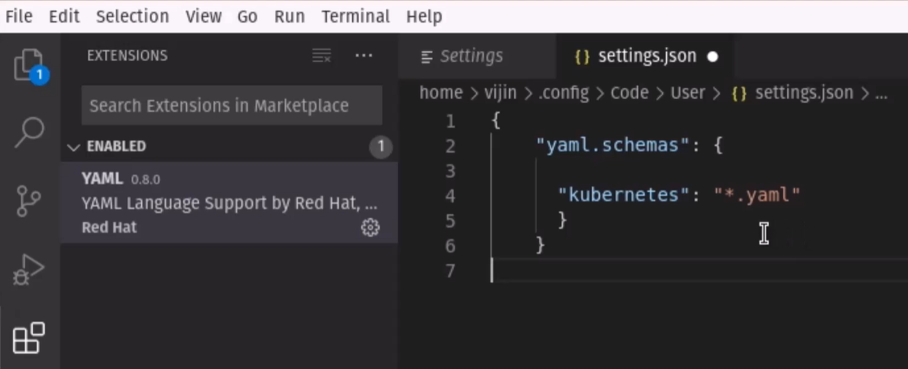

## YAML in kubernetes

Kubernetes uses YAML files as inputs for creation of objects such as
POD’s, replicas, deployment services etc. all of these follow structure, kubernetes
definition file always contains 4 top level fields.  
 
 ```bash
**Kind:** It refers to the type of object we’re trying to create.  
**Metadata:** The metadata is data about the object like its name labels etc.  
**Label:** Say for example there are hundreds of pods running a front end application and hundreds of running a backend application or a database, it will be difficult for you to group these pods once they’re deployed. If we label them as frontend, backend or a database then we will be able to filter the pods.  
**Spec:**  
  **Containers:** This is a list, because the pods can have multiple containers within them.
```

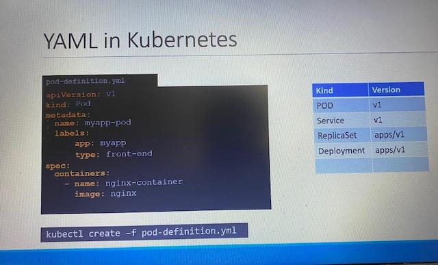

**Kubernetes schemas** – the term is often used to refer to a graphical depiction of the database
structure. In other words, schema is the structure of the database that defines the objects in the database.

## Replication controllers and replica sets

Controllers are the brains behind kubernetes, they are the processes that monitors kubernetes
objects and respond accordingly. The replication controller helps run multiple instances of a
single pod in the kubernetes cluster, thus providing a high
availability. Even if we have a single pod, the replication controller
can help by automatically bringing up a new pod when the existing one
fails. The replication controller ensures that the specified number of
pods are running at all times, another reason we need a replication
controller is to create multiple pods to share the load across them.
The replication controller spans across multiple nodes in the cluster.
There are similar terms replication controller and replica set, both
have the same purpose, but they are not the same. Replication
controller is the older technology that is being replaced by replica
sets. Replica set is the new recommended way to set up replication.

**To create a replication controller**:  

We start with creating a replication controller definition file, we will
name it as rc-definition.yml.  
For any kubernetes definition file, the spec section defines what’s
inside the object we are creating.

### Replication controller  

In a Kubernetes definition file, the `spec` section defines the desired state of the object.

A ReplicationController is used to create and maintain multiple replicas of a Pod.

To define which Pod should be created, a `template` section is specified under `spec`. 
This template contains the Pod definition, which is used by the ReplicationController 
to create and manage multiple identical Pod replicas.

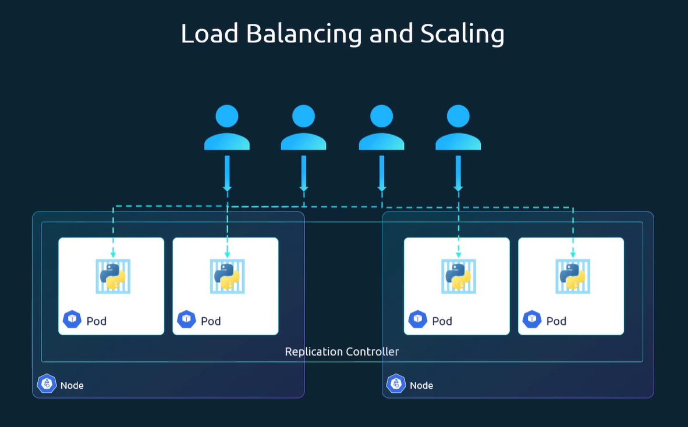

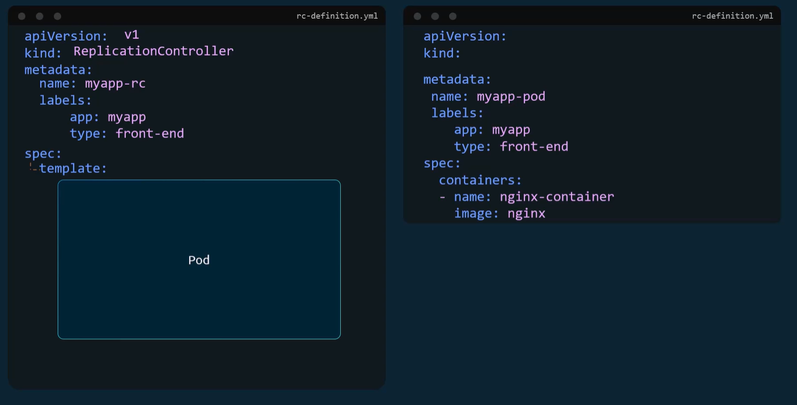

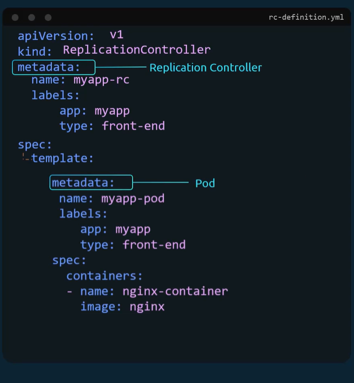

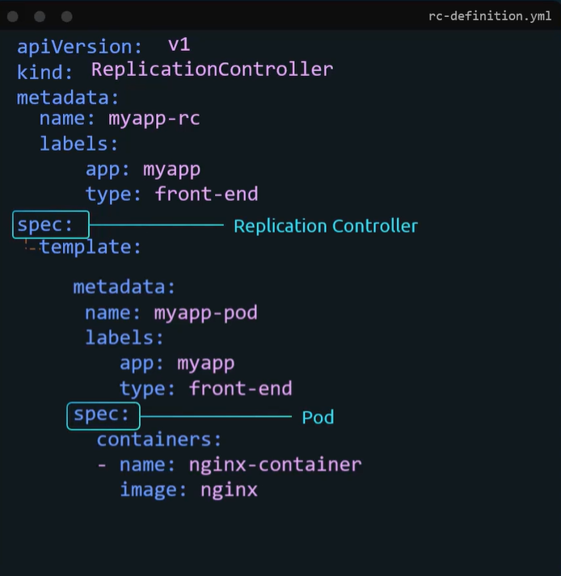

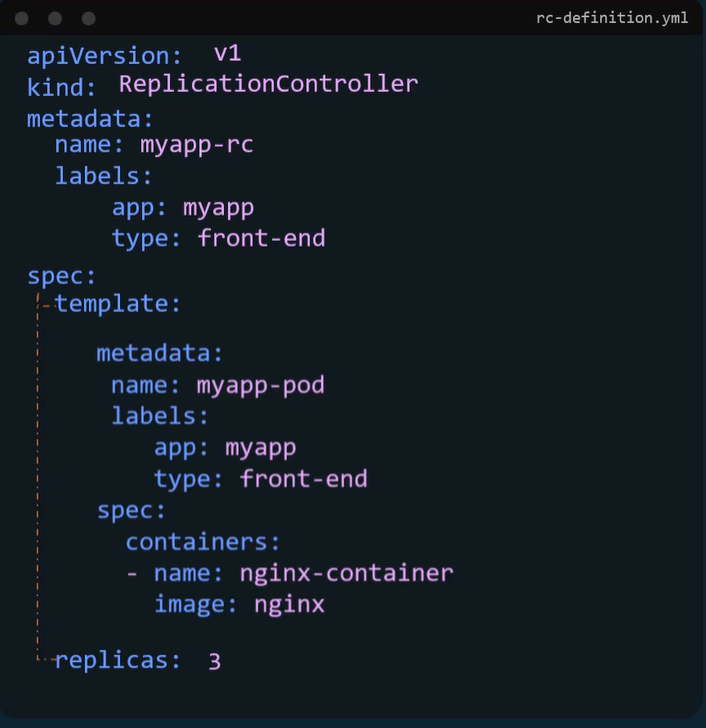

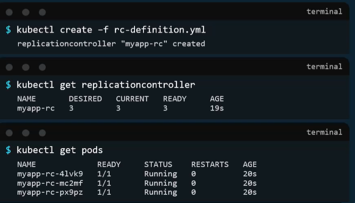

## Replication set

It is very similar to a replication controller. There is one major
difference between replication controller and replica set, the replica
set requires a selector definition, the selector section helps the
replica set identify what pods fall under it. But why would you have to
specify what pods fall under it, if you have provided the contents of
the Pod definition file itself in the template? It’s because ReplicaSet
can also manage Pods that were not created as part of the ReplicaSet
creation. Say for example, there were pods created before the creation
of the ReplicaSet that match labels specified in the selector. The
ReplicaSet will aslo take those pods into consideration when creating
the replicas. The role of the replica set is to monitor the pods and if
any of them were to fail, deploy new ones.

As said, the major difference is the selector field, the selector is not
a required field in case of a Replication Controller, but it is still
available when you skip it, it assumes it to be the same as the labels
provided in the Pod definition file. In the case of ReplicaSet, a user
input is required for this property and it has to be written in the form
of **matchLabels.** The match labels selector simply matches the labels
specified under it to the labels of the Pods. The ReplicaSet selector
also provides many other options for matching Labels that were not
available in a Replication Controller.

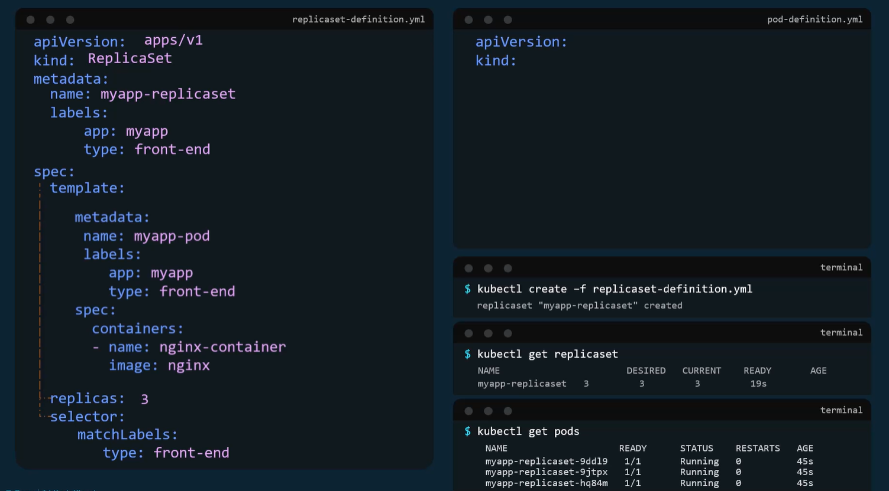**Labels
and selectors**

Why do we label the pods and objects in kubernetes? The role of the
replica set is to monitor the pods(which are already created or else
create new ones) and if any of the pods goes down, it creates a new one.
Now, how does the replica set know, what pods to monitor, there could be
hundreds of other pods in the cluster running different application,
this is where labeling the pods during creation comes in handy, we could
now provide these labels as a filter for replica sets under the selector
section, we use the match labels filter and provide the same label that
we used while creating the pods. This way, the replica set knows which
pods to monitor.

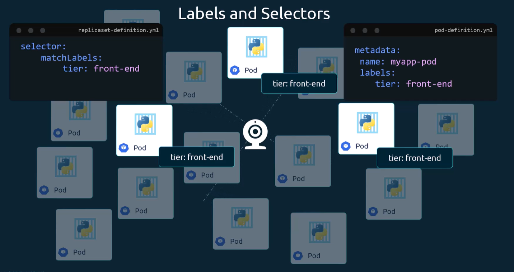

**Scale of ReplicaSets** -  
  
**There are multiple ways to scale a ReplicaSet. One way is to edit the
replicaset-definition.yml file and modify the replicas field. Another
way is to use the kubectl command, as shown in the image below. However,
replicas increased using the kubectl command will not be permanent, as
the changes will not be updated in the replicaset-definition.yml file.

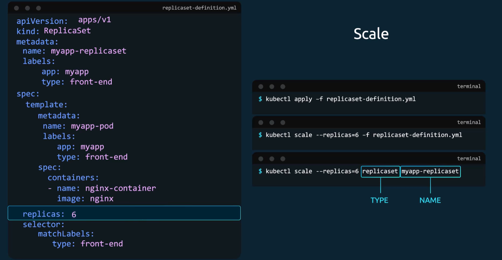

## Deployments

If the application needs to be updated with the newer version, which is
deployed on many docker instances, it should be done one at a time
instead of all at once, as the users using the application may not be
impacted, such type of upgrade is known as rolling updates.

Finally say for example you would like to make multiple changes to your
environment such as upgrading

the underlying Web Server versions as well as scaling your environment
and also modifying the resource

allocations etc. You do not want to apply each change immediately after
the command is run, instead you like to apply a pause to your
environment, make the changes and then resume so that all the changes
are rolled out together. All of these capabilities are available with
the Kubernetes deployments.

Each container is encapsulated in pods, multiple such pods are deployed
using replication controllers or replica sets and then comes deployment,
which is a kubernetes object that comes higher in the hierarchy, the
deployment provides us with the capability to upgrade the underlying
instances seamlessly using rolling updates, undo changes pause and
resume changes as required.

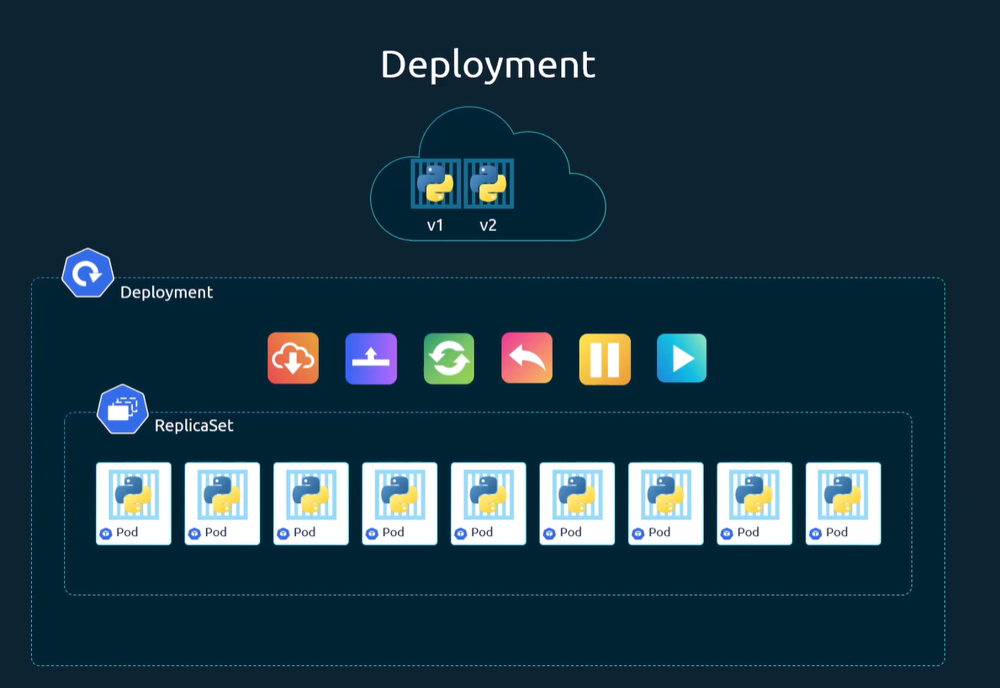

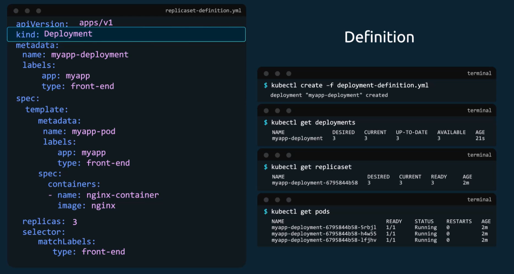

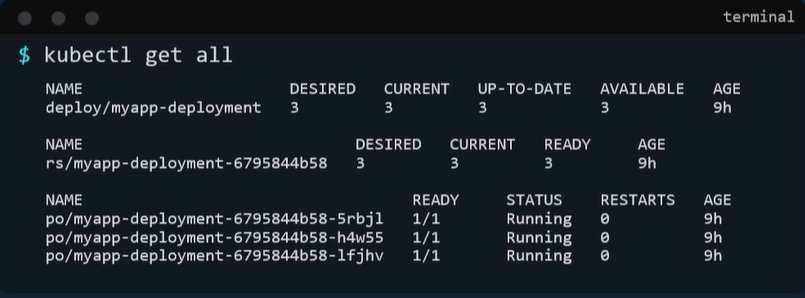

**Deployments - updates and rollbacks**

Before we look at how we upgrade our application, let’s try to
understand rollouts and versioning in a deployment. When you first
create a deployment, it triggers a rollout. A new rollout creates a new
replica set, which is recorded as a new deployment revision. In the
future, when the application is upgraded, meaning when the container
version is updated to a new one, a new rollout is triggered and a new
deployment revision is created named revision 2. This helps us keep
track of the changes made to our deployment and enables us to roll back
to a previous version of deployment if necessary.

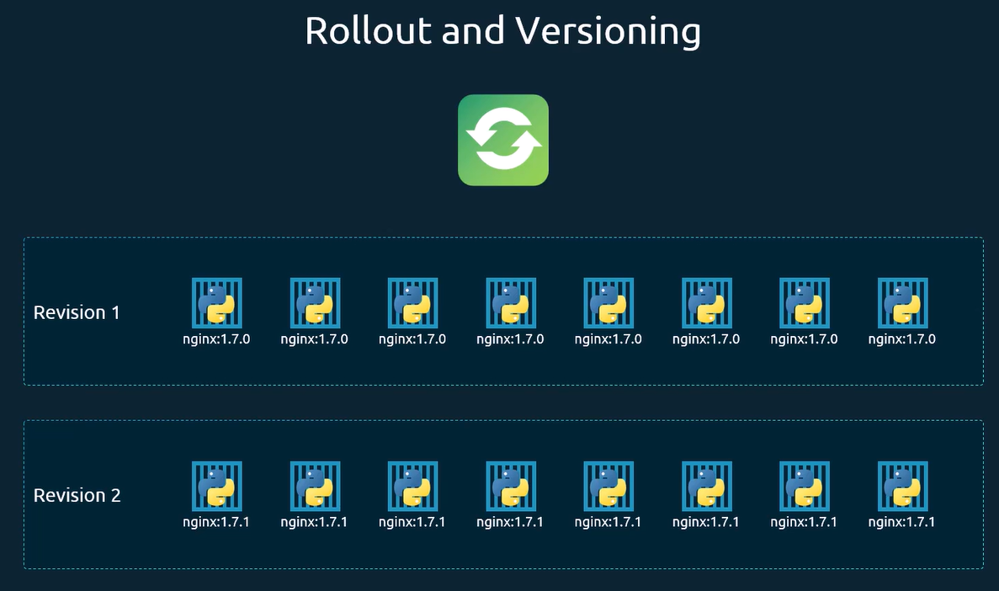

**Deployment Strategy**

There are 2 types of deployment strategies. Say, for example, you have 5
replicas of your web application instance deployed. One way to upgrade
these to a newer version is to destroy all of these and then create
newer versions of application instances. Meaning, first destroy the 5
running instances and then deploy 5 new instances of the new application
version. The problem with this, as you can imagine, is that during the
period after the older versions are down, and before any newer version
is up, the application is down and inaccessible to users. This strategy
is known as the **recreate** strategy.

The second strategy is where we do not destroy all of them at once.
Instead, we take down the older version and bring up the newer version
one by one. This way, the application never goes down, and the upgrade
is seamless. This strategy is called a **rolling update** and is the
default one.

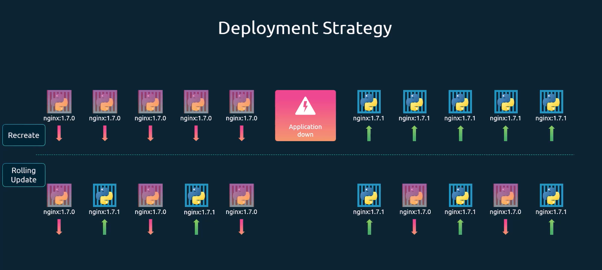

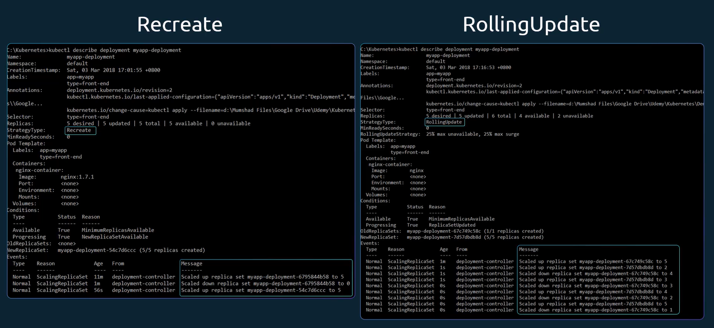

**Upgrades in deployment**

Let’s look at how a deployment performs an upgrade under the hoods. When
a new deployment is created, say to deploy 5 replicas, it first creates
a replica set automatically, which in turn creates the number of pods
required to meet the number of replicas, as shown in the below image.

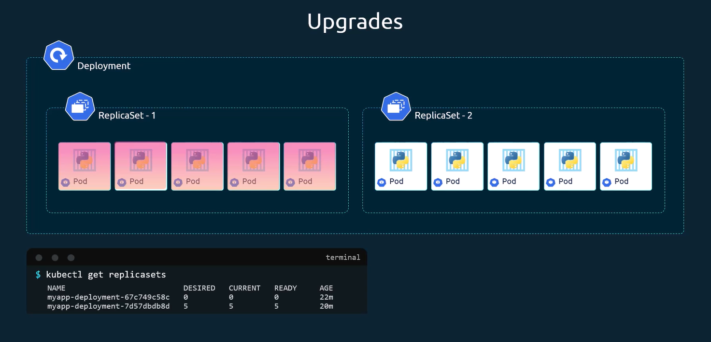

Say, for instance, once you upgrade your application, you realize
something isn’t very right, something’s wrong with the new version of
the build you used to upgrade, so you would like to roll back your
update? K8’s deployments allow you to roll back to a previous revision.
To undo a change, run the

kubectl rollout undo deployment &lt;deploymentname&gt;

The deployment will then destroy the pods in the new replica set and
bring the older ones up in the old replica set, and your application is
back to its older format.

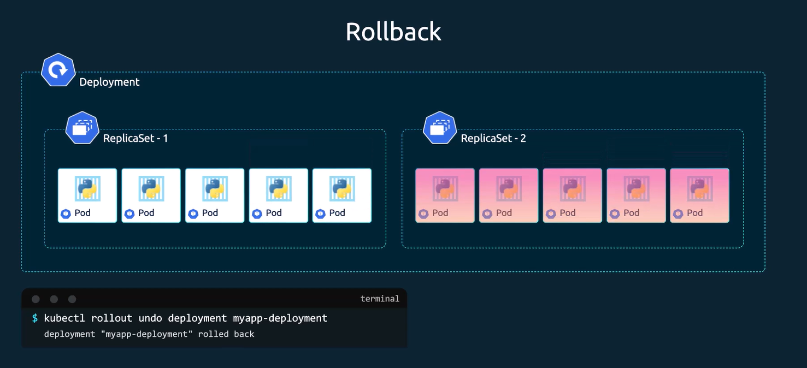

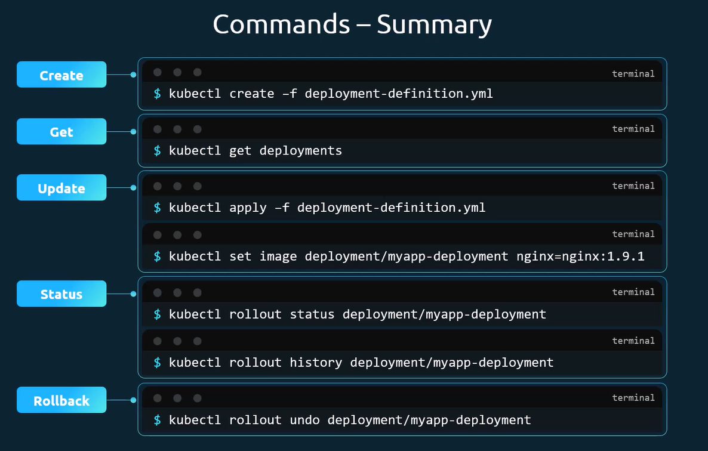

## Networking

We will start with a single node K8’s cluster. The node has an IP
address, say it is 192.168.1.2. In this case, this is the IP address we
use to access the K8’s node, SSH into it, etc., So, on the single node
K8’s cluster, we have created a single pod, as it is known, a pod hosts
a container. Unlike in the docker world, where an IP address is always
assigned to a docker container, in the K8’s world, the IP address is
assigned to a pod. Each pod in the K8’s gets its own internal IP
address. In this case, it’s in the range 10.244 series and the IP
assigned to the pod is 10.244.0.2. So, how is it getting this IP
address? When K8’s is initially configured, we create an internal
private Network with the address 10.244.0.0 and all the pods are
attached to it. When you deploy multiple pods, they all get a separate
IP assigned from this network. The pods can communicate to each other
through this IP, but accessing the other pods using this internal IP
address may not be a good idea, as it’s subject to change when pods are
recreated.

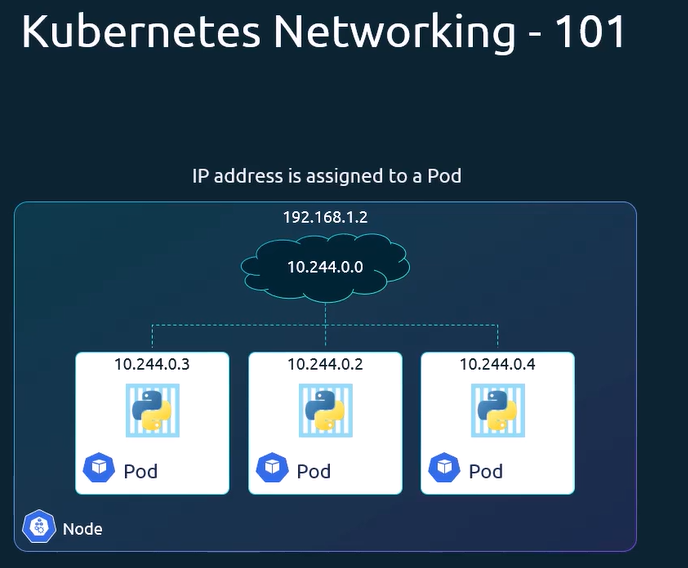

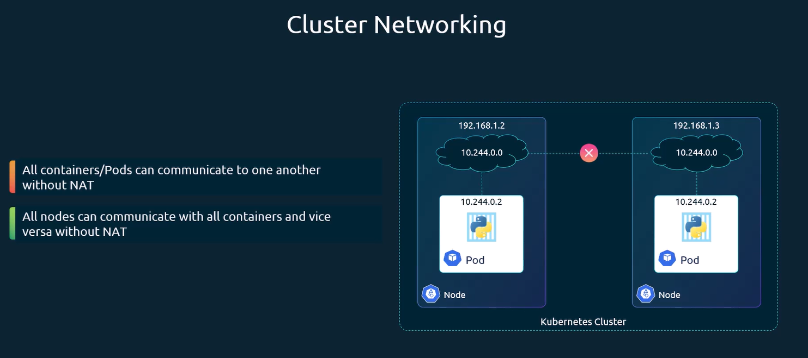

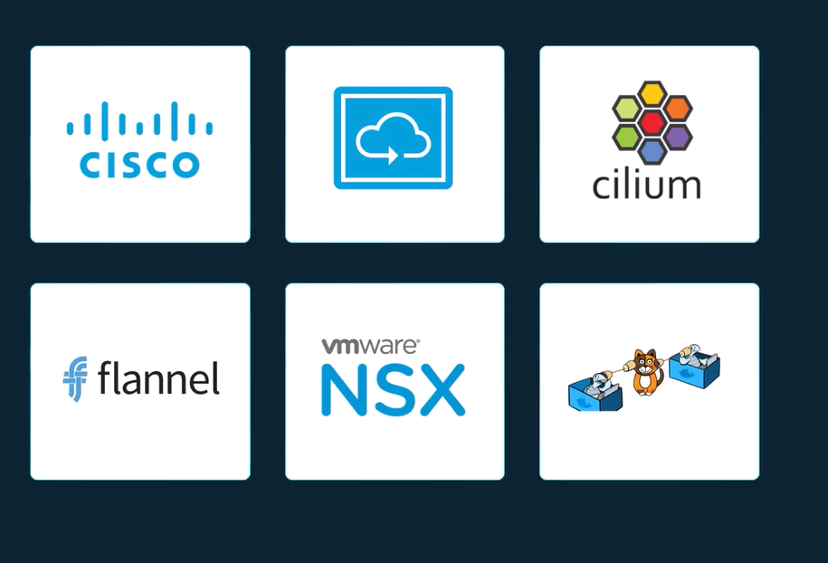

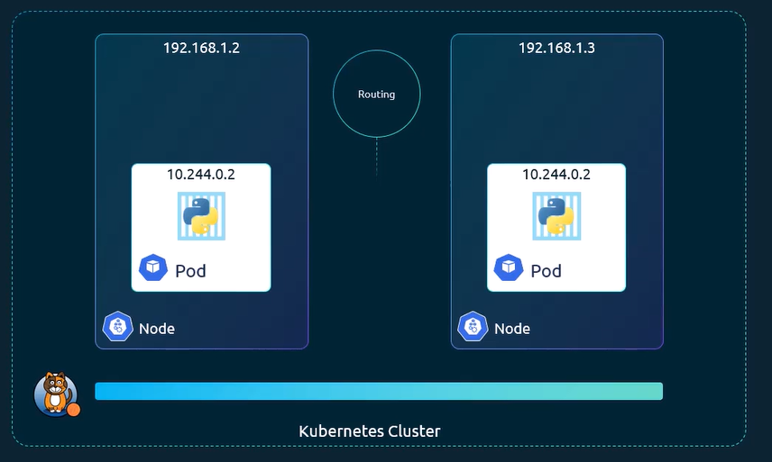

## Kubernetes services

**Services-node port**

Kubernetes services enable communication between various components
within and outside of the application, this service helps us connect
applications together with other applications or users. A service is
only required if the application has some kind of process or database
service or web service that needs to be exposed, that needs to be
accessed by others.

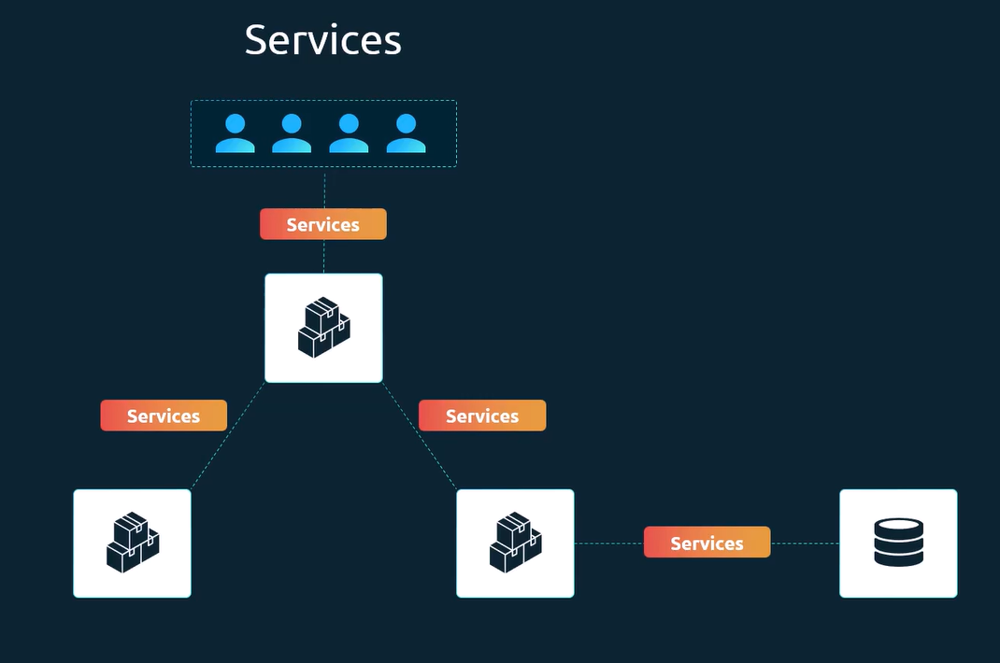

For example, our application has groups of pods running various
sections, such as a group for serving front end load to users and other
groups for running backend processes, and a third group connecting to an
external data source. It is a service that enables connectivity between
these groups of pods.

Kubernetes service is an object just like pod, replica set, and
deployments. One use case of services is to listen to a port on the
node and forward requests on that port to a port running the web
application. This type of service is known as node port service.

Let’s look at the below setup, the kubernetes node has an IP address,
i.e., 192.168.1.2, and the laptop is on the same network as well, so it
has an IP address of 192.168.1.10. The internal Pod network is in the
range of 10.244.0.0, and the Pod has an IP 10.244.0.2, clearly it is not
possible to ping the Pod or access the Pod at address 10.244.0.2, as
it’s in a separate network. So, what are the options to see the web
page? first, if we were to SSH into K8’s node at 192.168.1.2, from the
node we would be able to access the pods web page by doing a curl
command i.e., curl [<span
class="underline">http://192.168.1.2</span>](http://192.168.1.2) or if
the node has GUI, we would fire up a browser and see the web page in a
browser following the address at [<span
class="underline">http://10.244.0.2</span>](http://10.244.0.2). Bu this
is from inside the K8’s node, and that’s not what I want. I want to be
able to access the web server from my own laptop without having to SSH
into the node and simply by accessing the IP of the kubernetes node. So,
we need something in the middle to help us map requests to the node from
our laptop through the node to the pod running the web container. This
is where the K8’s service comes into play. The K8’s service is an
object, just like pods, replica sets or deployments that we worked with
before. One of its use cases is to listen to ports on the node and
forward requests on that board to a port on the port running the web
application. This type of service is known as a node port service
because the service listens to a port on the node and forward requests
to the pods.

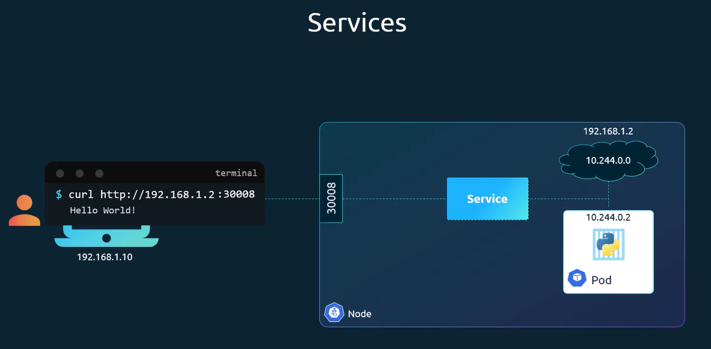

There are other kinds of services available -

1.  Node port

2.  Cluster IP → In this case, the service creates a virtual IP inside
    the cluster to enable communication between different services,
    such as a set of front-end servers to a set of backend servers.

3.  Load balancer → In this case, it provisions a load balancer for our
    application in supported cloud providers. A good example of that
    would be to distribute load across the different web servers in
    the front-end tier.

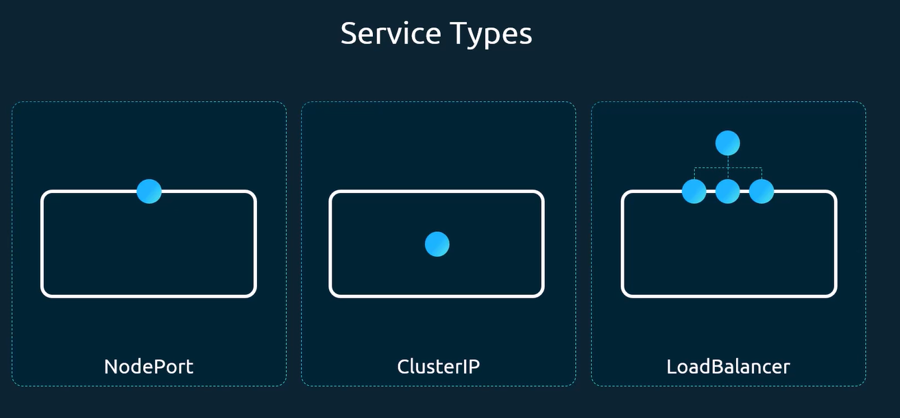

NodePort - If we look at the NodePort service as below - there are three
ports involved, the port on the pod where the actual web server is
running is 80, and it is referred to as the target port, because that is
where the service forwards the requests to. The second port is the port
on the service itself. It is simply referred to as the port. Remember,
these terms are from the view point of the service. The service is in
fact like a virtual server inside the node. Inside the cluster, it has
its own IP address and that IP address is called the cluster IP of the
service.

Node ports can only be in a valid range, which by default is from 30000
– 32767

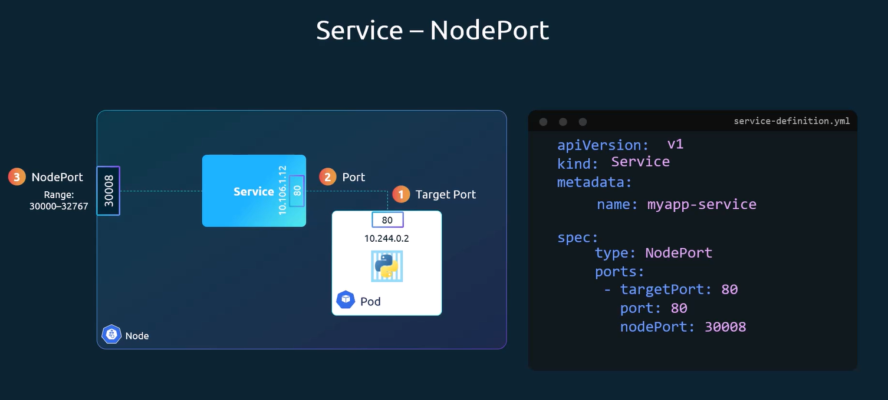

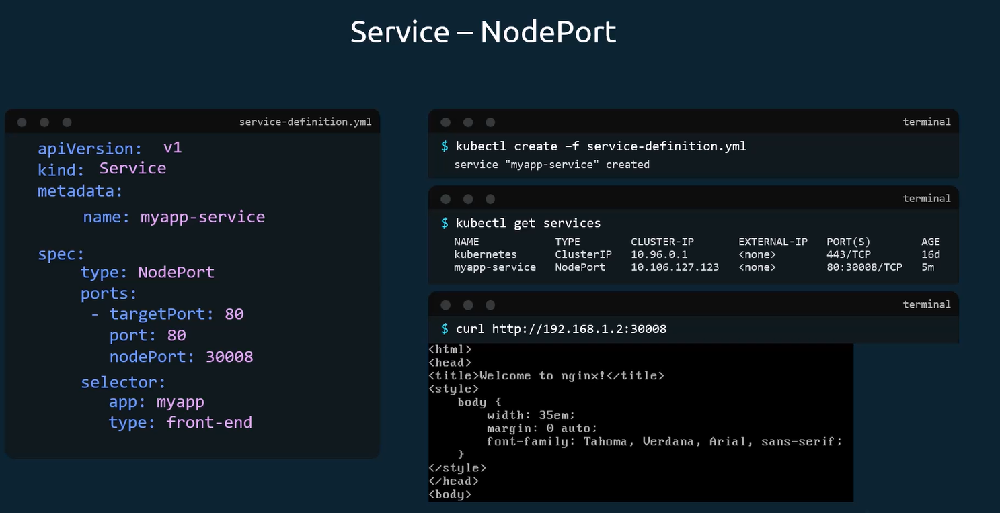

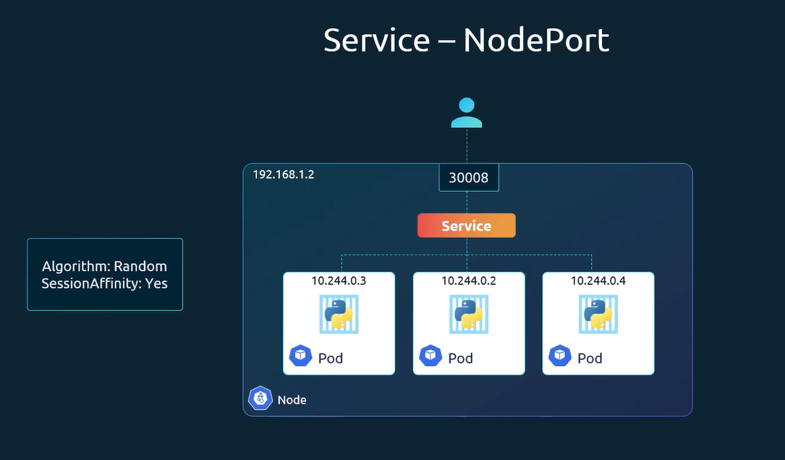

**Multiple Nodes in a Cluster**

When we create a service without us having to do any additional
configuration, Kubernetes automatically creates a service that spans
across all the nodes in the cluster and maps the target port to the same
node port on all the nodes in the cluster. This way, you can access your
application using the IP of any node in the cluster. To summarize, in
any case, whether it be a single pod on a single node, multiple pods on
a single node or multiple pods on multiple nodes, the service is created
exactly the same.

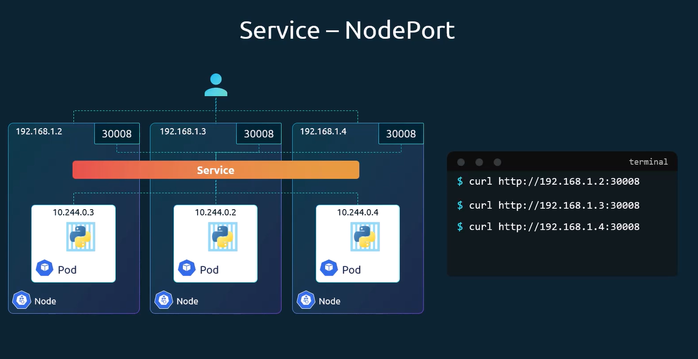

The selector links the Service to a set of Pods with matching labels. The Service then routes traffic from its own port to the application's targetPort on those Pods. If the Service type is NodePort, it makes that internal service accessible via a specific port on the Node's IP

**Cluster-IP**

A full stack web application typically has different kinds of pods
hosting different pods of an application.

In this case, the service creates a virtual IP inside the cluster to
enable communication between different services, such as front end
servers to a set of backend servers.

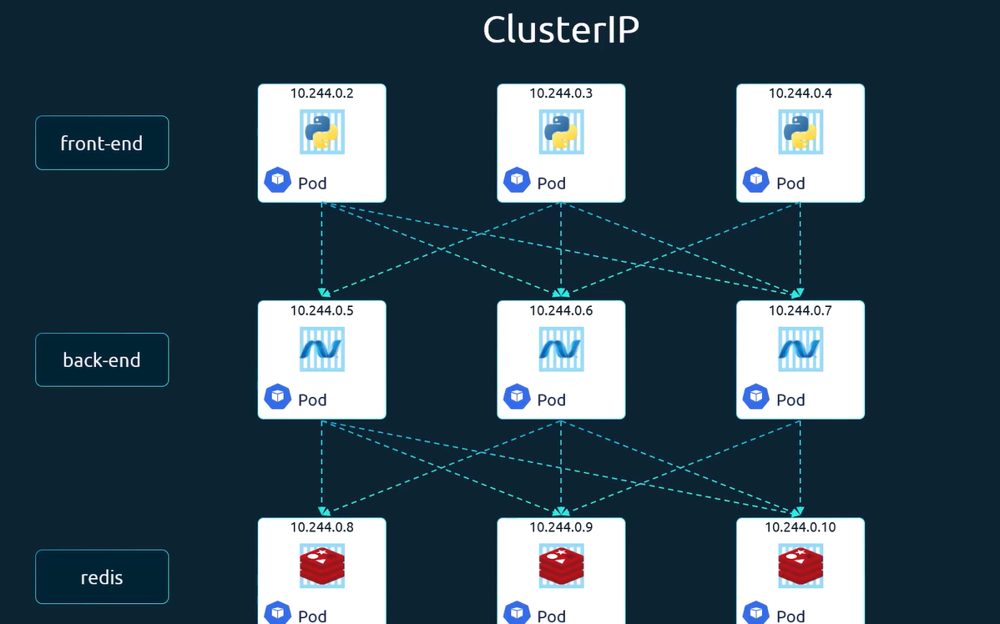

The web front-end server needs to communicate to the backend servers and
the backend servers need to communicate to the database, as well as the
redis services etc., So, what is the right way to establish connectivity
between these services or tiers of an application? The pods all have an
IP address assigned to them, but these IP’s, as we know, are not static.
These pods can go down anytime, and new pods are created all the time,
and so you cannot rely on these IP addresses for internal communication
between the applications.

To overcome this we use **cluster IP** service, this enables us to
easily and effectively deploy a microservices based application on K8’s
cluster. Each layer can now scale or move as required without impacting
communication between the various services. Each service gets an IP, a
name assigned to it inside the cluster, and that is the name that should
be used by other pods to access the service. This type of service is
known as **cluster IP** service. and is the default service in K8’s.

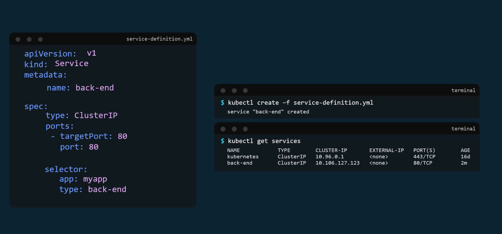

**Load-balancer**

The third type is a load balancer where it provisions a load balancer
for our application in supported cloud providers.

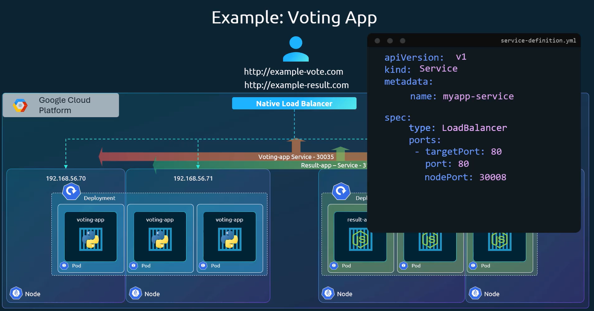

**maxSurge →** First kill the pod, then create.

**maxUnavailable** → First create the pod, then kill.

**CronJob** will create a job and job in return will create a **POD.**

> [<span
> class="underline">https://www.mirantis.com/cloud-native-concepts/getting-started-with-kubernetes/what-is-kubernetes-management/?utm\_source=google&utm\_medium=paidsearch&utm\_campaign=15835777586&utm\_adgroup=132106624541&utm\_content=598619916421&utm\_term=kubernetes%20engine%20cluster&utm\_region=america&utm\_focus=non-brand&gclid=Cj0KCQjwlK-WBhDjARIsAO2sErQz4FvDtAgpRWt4ej37mQg697nngebh8Qf7lPLvO3hXnfRZGDdEWmcaAqibEALw\_wcB</span>](https://www.mirantis.com/cloud-native-concepts/getting-started-with-kubernetes/what-is-kubernetes-management/?utm_source=google&utm_medium=paidsearch&utm_campaign=15835777586&utm_adgroup=132106624541&utm_content=598619916421&utm_term=kubernetes%20engine%20cluster&utm_region=america&utm_focus=non-brand&gclid=Cj0KCQjwlK-WBhDjARIsAO2sErQz4FvDtAgpRWt4ej37mQg697nngebh8Qf7lPLvO3hXnfRZGDdEWmcaAqibEALw_wcB)
> 🡪 Kubernetes cluster

## Commands

  - To create and run a single Pod in the Kubernetes cluster – `kubectl run podname --image=dockerimagname`
  - To view information about the cluster - `kubectl cluster-info`
  - To list all the nodes, part of the cluster – `kubectl get nodes`
  - To list the pods in the cluster – `kubectl get pods`
  - To get more information about the pod – `kubectl describe pod <podname>`
  - To check the status of the pod – `kubectl get pods –o wide`
  - To check in which pods the nodes placed on - `kubectl get pods –o wide`
  - To know the OS on which the Kubernetes nodes are running- `kubectl get nodes –o wide`
  - To run the kubernetes yml script- `kubectl apply (or create) –f <scriptname.yml>` 
  - To know the kubernetes version – `kubectl version`
  - To delete the pod – `kubectl delete pod podname`
  - To update or edit the image of the pod – `kubectl edit pod redis`
  - To list the number of replica sets on the system – `kubectl get replicaset or kubectl get rs`
  - To update or edit the replica set – `kubectl edit replicaset rsname`
  - After the modifing the file, to increase the replicas – `kubectl replace –f replicaset-definition.yml`
  - To scale up the replicas using command – `kubectl scale -replicas=x(number of replicas) –f replicaset-definition.yml`
  - To create a replica set – `kubectl create –f replicaset-definition.yml`
  - To delete the replica set – `kubectl delete replicaset replicasetname` (Also deletes pods in it)
  - To run the updated replicaset file – `kubectl replace –f replicaset-definition.yml name`
  - To list the number of deployments – `kubectl get deploy`
  - To list the services – `kubectl get services`
  - To get the target port configured on the service – `kubectl describe service`
  - To see all the created objects at once – `kubectl get all`
  - To list more info about deployments – `kubectl describe deployment deploymentfilename`
  - To check the rollout status – `kubectl rollout status deployment/deploymentname`
  - To check the history of deployment – `kubectl rollout history deployment/deploymentname`
  - To roll back the deployment – `kubectl rollout undo deployment/deploymentname`.
  - To create the deploment – `kubectl create -f deployment definition.yml`
  - To list the deployments – `kubectl get deployments`
  - To update the deployment – `kubectl apply –f deployment-definition.yml` (or) using image - Kubectl set image deployment/deploymentname old=new(ex:nginx-nginx:1.9.1) Using the image command the configuration also changes.
  - To record the cause of change – `kubectl create –f deployment.yaml -- record`
  - To edit the deployment – `kubectl edit deployment deploymentname --record`
  - To know the deployment – `kubectl get deployment deploymentname`
  - To run the script – scriptname run (example- /root/curl-test.sh run)
  - To get pods and services together –`kubectl get pods, svc`
  - To scale up the deployments – `kubectl scale deployment deploymentname - - replicas=3`
  - To get short names for features on kubernetes - `kubectl api-resources`
  - To list deployments across all namespaces in a Kubernetes cluster – `kubectl get deployments -A`
  - To get the labels attached to the pod - `kubectl get pods --show-labels`
  - To create a template creation using the index.html file or any other - `kubectl create deployment nginx --image=nginx --dry-run=client -o=yaml &gt; deployment.yaml`
  - When you store secret in a file(in k8s), and you want to convert it to base64, always use -n in echo command, or else it will generate space at the end of the secret stored in a file → echo -n $string | base64
  - To get nodes memory - `kubectl top nodes`
  - To get pods memory- `kubectl top pods`
  - To create a Kubernetes pod with resource limits (CPU and memory) using the imperative method, use the kubectl run command with --dry-run=client to generate a YAML template, edit it to include limits, and apply it -
kubectl run nginx --image=&lt;imagename&gt; --dry-run=client -o yaml &gt; pod.yaml
  - To create a deployment using imperative method to generate a manifest file -
     kubectl create deployment nginx \\  
     --image=nginx \\  
     --replicas=3 \\  
     --dry-run=client \\  
     -o yaml &gt; deployment.yaml
  - To get the current cluster - `kubectl config current-context`
  - To get the list of microservices running in cluster - `kubectl get all`
  - To check the list of microservices in a particular namespace - `kubectl get all -n <namespace>`
  - To get the service account list - `kubectl get sa`
